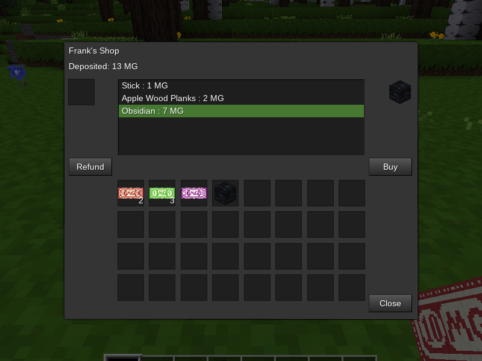

## Server Shop

### Description:

Shops intended to be set up by [Minetest](https://www.minetest.net/) server administrators.

No craft recipe is given as this for administrators, currently a machine can only be set up with `/giveme server_shop:shop` command.

***WARNING:** this mod is not ready for active use*

<!--  -->

#### Usage:

TODO

### Licensing:

- Code: [MIT](LICENSE.txt)
- Textures: [CC0](textures/sources.txt)

### Dependencies:

- Required:
  - none
- Optional:
  - none

Compatible with:

### Links:

- [Minetest forum]()
- [GitHub repo]()
- [Changelog](CHANGES.txt)
- [TODO](TODO.txt)
