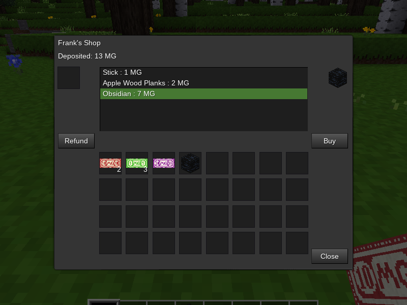

## Server Shops

### Description:

Shops intended to be set up by [Luanti](https://www.luanti.org/) server administrators.

No craft recipe is given as this is for administrators, currently a shop can only be set up with the
`/giveme` command or from creative inventory. The two shop nodes are `server_shop:shop_small` &
`server_shop:shop_large` (they function identically).



### Usage:

#### Registering Shops via API:

There are two types of shops, seller & buyer. A seller shop can be registered with
`server_shop.register_seller(id, products)`. A buyer with `server_shop.register_buyer(id, products)`
. `id` is a string identifier associated with the shop list. `products` is the shop list definition.
Shop lists are defined in a table of tuples in `{itemname, value}` format. `itemname` is the
technical string name of an item (e.g. `default:wood`). `value` is the number representation of what
the item is worth.

*Example:*

```lua
-- register seller
server_shop.register_seller("frank", {{"default:wood", 2}})

-- register buyer
server_shop.register_buyer("julie", {
  {"default:copper_lump", 5},
  {"default:iron_lump", 6},
})
```

#### Registering Shops via Configuration:

Shops can optionally be configured in `<world_path>/server_shops.json` file. To register a shop, set
key to shop `id`. In the shop table, set `type` to "sell" or "buy". `products` is an array of
item tuples in format ["name", value].

*Example:*

```json
{
  "shops": {
    "frank": {
      "type": "sell",
      "products": [
        ["default:wood", 2]
      ]
    },
    "julie": {
      "type": "buy",
      "products": [
        ["default:copper_lump", 5],
        ["default:iron_lump", 6]
      ]
    }
  }
}
```

#### Registering Shops via Chat Command:

The `server_shop` chat command is available to administrators with the `server` privilege. This is
used for administering shops & updating configuration.

Usage:

```
/server_shop <command> [<params>]

# Commands:

/server_shop help [command]
- Shows usage info.

/server_shop list
- Lists all registered shop IDs.

/server_shop info <ID>
- Lists information about shop.
- parameters:
  - ID: shop identifier

/server_shop register <ID> <type> [<products>]
- Registers a new shop. (changes are written to config)
- parameters:
  - ID: shop identifier
  - type: can be "buy" or "sell"
  - products: comma-separated list in format "item1=value,item2=value,..."

/server_shop unregister <ID>
- Unregisters a shop. (changes are written to config)
- parameters:
  - ID: shop identifier

/server_shop add <ID> <products>
- Adds one or more items to a shop's product list. (changes are written to config)
- parameters:
  - ID: shop identifier
  - products: comma-separated list in format "item1=value,item2=value,..."

/server_shop remove <ID> <product>
- Removes first instance of an item from a shop's product list. (changes are written to config)
- parameters:
  - ID: shop identifier
  - product: name of item to be removed

/server_shop removeall <ID> <product>
- Removes all instances of an item from a shop's product list. (changes are written to config)
- parameters:
  - ID: shop identifier
  - product: name of item(s) to be removed

/server_shop reload
- Reloads shops configuration.
```

#### Registering Currencies:

Currencies can be registered with `server_shop.register_currency`:

```lua
server_shop.register_currency("currency:minegeld", 1)
server_shop.register_currency("currency:minegeld_5", 5)
```

Currencies are registered under the "currencies" table in `server_shops.json`. It is filled with
item values indexed by item name.

```json
{
  "shops": {
    ...
  },
  "currencies": {
    "currency:minegeld": 1,
    "currency:minegeld_5": 5
  }
}
```

You can also register a currency suffix to be displayed in the formspec. Simply set the string value
of `server_shop.currency_suffix`:

```lua
server_shop.currency_suffix = "MG"
```

In `server_shops.json`, simply set value of "suffix" index to the string to be displayed:

```json
{
  "shops": {
    ...
  },
  "suffix": "MG"
}
```

By default, if the [currency][mod.currency] mod is installed, the minegeld notes will be registered
as currency. This can be disabled by setting `server_shop.use_currency_defaults` to `false` in
`minetest.conf`.

#### Setting up Shops in Game:

Server admins use the chat command `/giveme server_shop:shop_small` or
`/giveme server_shop:shop_large` to receive a shop node. After placing the node, the ID can be set
with the "Set ID" button & text input field (only players with the "server" privilege can set ID).
Set the ID to the registered shop ID you want associated with this node ("frank" or "julie" for the
examples above) & the list will be populated with the registered products & prices.

#### Using Seller Shops:

To make purchases, player first deposits registered currency items into the deposit slot. Select an
item in the products list & press the "Buy" button. If there is adequate money deposited, player
will receive the item & the cost will be deducted from the deposited amount. To retrieve any money
not spent, press the "Refund" button. If the formspec is closed while there is still a deposit
balance, the remaining money will be refunded back to the player. If there is not room in the
player's inventory, the remaining balance will be dropped on the ground.

#### Using Buyer Shops:

For buyer shops, the product list shows what items can be sold to this shop & how much money a
player will receive for each item. To sell to the shop, place an item in the deposit slot. The slot
will only accept items that the owner will purchase. Press the "Sell" button to recieve the value of
the item(s).

### Licensing:

- Code: [MIT](LICENSE.txt)
- Textures: CC0

### Dependencies:

- Required:
  - [simple_models](https://content.luanti.org/packages/AntumDeluge/simple_models/)
  - [wdata](https://content.luanti.org/packages/AntumDeluge/wdata/)
- Optional:
  - [currency][mod.currency]
  - [minimalist_currency](https://content.luanti.org/packages/AntumDeluge/minimalist_currency/)
  - [mod_logger](https://content.luanti.org/packages/AntumDeluge/mod_logger/)
  - [sounds](https://content.luanti.org/packages/AntumDeluge/sounds/)

### Links:

- [](https://content.luanti.org/packages/AntumDeluge/server_shop/)
- [Forum](https://forum.luanti.org/viewtopic.php?t=26645)
- Git Repo Mirrors:
    - [Codeberg](https://codeberg.org/AntumLuanti/mod-server_shop)
    - [GitHub](https://github.com/AntumMT/mod-server_shop)
    - [GitLab](https://gitlab.com/AntumMT/mod-server_shop)
- [Reference](https://antummt.github.io/mod-server_shop/reference/latest/)
- [Changelog](changelog.txt)
- [TODO](TODO.txt)


[mod.currency]: https://content.luanti.org/packages/VanessaE/currency/
